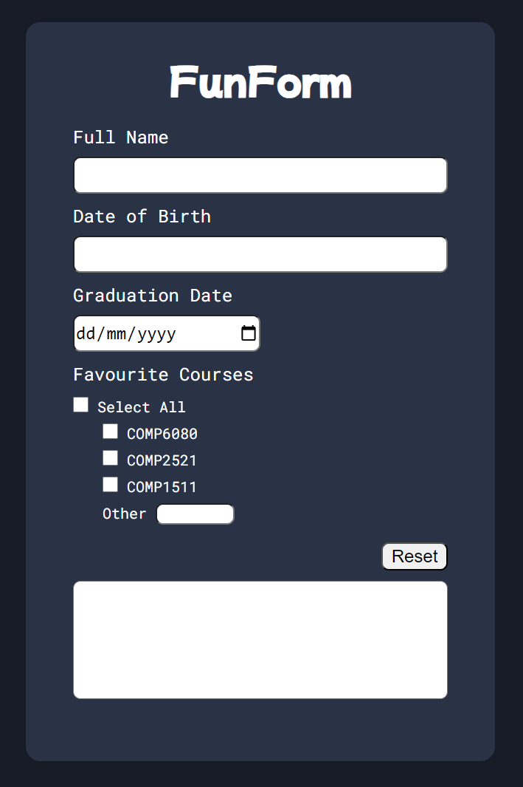

# Assessment 2 (Vanilla JS)

[Please see course website for full spec](https://cgi.cse.unsw.edu.au/~cs6080/NOW/assessments/assignments/ass2)

This assignment is due _Friday 4th October, 8pm_.

Please run `./util/setup.sh` in your terminal before you begin. This will set up some checks in relation to the "Git Commit Requirements".

## Your Task - FunForm

### 1. Overview

The HTML page in `task1/src/index.html` displays a series of inputs, and when valid, outputs a "summary" of this information in the textarea at the bottom of the page.

You are going to make this form dynamic and interactive through use of Javascript only **(Modification or addition of any HTML or CSS is prohibited)**.

#### 1.1. The page

The page consists of a:

- Form
  - Text input for `Full Name` (must be between 3 and 50 characters inclusive).
  - Text input for `Date of birth` (valid input is the exact format "DD/MM/YYYY" and must be a valid date. This means it must match the regex expression "[0-9]{2}/[0-9]{2}/[0-9]{4}" and when trying to parse it with the Javascript date object it does not return **NaN**).
  - Date input for `Graduation Date` (must be a date that comes after the date of birth input).
  - Checkbox for `Favourite Courses` (COMP6080, COMP2521, and COMP1511).
  - Text input for `Other` (must be 8 alphanumeric characters, beginning with 4 uppercase letters and ending with 4 numbers.). You can not assume that this input will be empty.
  - Checkbox to `Select All`.
- `Reset` button
- Textarea (initially blank)

#### 1.2. Actions

The following are events that trigger a render that should be binded to particular actions

- Blur of the "Full Name" or "Date of Birth" should trigger a render.
- Changing of the "Favourite Courses" or "Other" text input, or "Graduation Date" should trigger a render (you only need the render to take effect after the field is unfocused, not after keypress).

There are key buttons on the page:

- When the `Select All` checkbox is checked, all three course checkboxes are selected.
  - At any time when all 3 courses are selected, the `Select All` checkbox is checked.
  - At any time when one of the checkboxes are deselected, the `Select All` checkbox is unchecked.
- When the `Reset` button is clicked, the `textarea` has all of its text removed (i.e. it becomes blank again), and all of the form elements are reset to their default state.

#### 1.3. Rendering

The "output" refers to what the inner text should be of the textarea at the bottom of the page.

- If they haven't inputted a `Full Name`, or the `Full Name` entered is invalid, the output should be _"Please input a valid full name"_
- If they have inputted a `Full Name`, but haven't inputted a `Date of Birth` / the `Date of Birth` is invalid, the output should be _"Please input a valid date of birth"_
- If they have inputted a `Full Name` and `Date of Birth`, but haven't inputted a `Graduation Date` / the `Graduation Date` is invalid, the output should be _"Please input a valid graduation date"_
- If they have entered the above correctly, the output is _"My name is [full name] and I am [age (integer)] [year/years] old. I [graduate/graduated] on [graduation date], and [favourite courses]."_
  - If the age is 1, [year/years] is _"year"_, otherwise it is _"years"_.
  - If the graduation date is in the future, [graduate/graduated] is _"graduate"_, otherwise it is _"graduated"_.
  - [graduation date] is the `graduation date` in the format _"[3-letter month abbreviation] [DD] [YYYY]"_. For example, `25/06/2024` will show _"Jun 25 2024"_.
    - The 3-letter month abbreviations are Jan, Feb, Mar, Apr, May, Jun, Jul, Aug, Sep, Oct, Nov, and Dec.
  - If `other` input field is invalid or empty, it does not need to be included in [favourite courses] and there is no invalid message for this.
  - If no course is selected (`other` input field is considered a course), [favourite courses] is _"I have no favourite course"_
  - If 1 course is selected (`other` input field is considered a course), [favourite courses] is _"my favourite course is [course1]"_
  - If 2 courses are selected (`other` input field is considered a course), [favourite courses] is _"my favourite courses are [course1], and [course2]"_
  - If more than 2 courses are selected (`other` input field is considered a course), [favourite courses] is _"my favourite courses are [course1], [course2], and [course3]"_ etc, where ", and" joins the last and second last course.

Please note: The age needs to be accurate - you cannot just subtract this year from the date of birth year, you must also take into account months and days.

### 2. Getting started

This task requires you to modify `src/script.js` and **only** this file. Everything is done in this file. **Do NOT modify the HTML or CSS file**.

### 3. Sample outputs

The following are sample outputs for different valid combinations of value entries into the form.

1. My name is Eddy and I am 22 years old. I graduated on Jan 01 2024, and my favourite courses are COMP6080, COMP2521, and COMP1511.

2. My name is Kate and I am 21 years old. I graduated on Apr 04 2020, and my favourite courses are COMP6080, and DART1210.

3. My name is Hayden and I am 1 year old. I graduate on Jun 10 2025, and my favourite course is COMP6080.

4. My name is Eckles and I am 30 years old. I graduate on Dec 25 2026, and my favourite course is MATH1081.

5. My name is Hayden Eckles and I am 28 years old. I graduate on Sep 01 2026, and my favourite courses are COMP6080, COMP2521, COMP1511, and COMP6771.

Ensure that your output in the textarea matches the **spacing, letter casing and wording** for each of the examples provided. Also note that courses are listed in order of their checkbox.

Please note: courses are listed in order of how we describe them, NOT in the order they are clicked. Regardless of the order they were clicked the output will follow the same pattern.

You need to write Javascript (typically a combination of event listeners and DOM manipulations) that listen for actions described in `1.2` and render the page described in `1.3` in conjunction with any constraints described in `1.1`.
